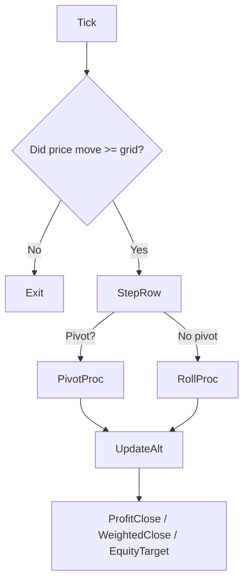

# Trinity‑TPS Developer README

> **Audience**: Core maintainers / ChatGPT‑o3.
>
> Use this file as **the single source of truth** whenever you (re)load the project context.
> If responses start drifting or logic feels fuzzy, **re‑read this page first.**

---

## 1. Project Scope

Trinity (`Trinity*.mq5`) is a **grid‑following entry engine** that *always* maintains a Buy/Sell pair on price, creating a chessboard of positions every ½‑pip (default).
TPS (`TPS*.mq5`) is an **overlay strategy** that rides the *mountain–valley* structure produced by Trinity, adding supplementary entries/ exits for extra alpha.

```
┌──────────────┐      ┌──────────────┐
│   Trinity    │----►│     TPS      │
│  grid core   │      │ set overlay │
└──────────────┘      └──────────────┘
```

*Both* share the same row/column bookkeeping described below.

---

## 2. Glossary & Invariants

| Term              | Meaning                                                                                                                                                          | Invariant                                        |
| ----------------- | ---------------------------------------------------------------------------------------------------------------------------------------------------------------- | ------------------------------------------------ |
| **Row (r)**       | Integer offset of current price from last Pivot in grid units. Positive → uptrend, negative → downtrend.                                                         | On every tick we track `lastRow`.                |
| **Pivot**         | **First** row of a **trend reversal** (direction sign flip). Example path `… 0→1→2→1→0→‑1→0` → Pivots at rows `2` and `‑1`.                                      | Determined when `dir != trendSign` in `StepRow`. |
| **Column (c)**    | Horizontal slot in the matrix. New columns are only opened at **Pivot**.                                                                                         | `nextCol` monotone increasing.                   |
| **TrendPair**     | Two adjacent cols (B/S) that track current trend.                                                                                                                | Exactly *one* active pair at any time.           |
| **Profit col**    | The *winning* side of TrendPair after Pivot; held until price retraces 1 grid (`refRow‑1`).                                                                      | At most one active.                              |
| **Alternate col** | The *losing* side plus all historical losers turned mean‑reversion stacks. Always keeps an **odd** number of lots (1,3,5,…) by alternating direction every grid. | Never auto‑closed except by **WeightedClose**.   |
| **Pending col**   | Empty column waiting to be recycled to Trend.                                                                                                                    |                                                  |
| **WeightedClose** | BE flush: if an Alternate column has ≥3 lots **and** aggregate P/L ≥0 **and** lot count is odd → close entire column.                                            |                                                  |
| **Roll**          | Move TrendPair *vertically* by 1 row without opening new columns (close old row lots, open same columns on new row).                                             |                                                  |

---

## 3. Execution Flow (high level)



### 3.1 `StepRow(newRow, dir)`

| Phase                  | Key Calls                                                       | Purpose                                                           |
| ---------------------- | --------------------------------------------------------------- | ----------------------------------------------------------------- |
| **Identify Pivot**     | `pivot = (trendSign!=0 && dir!=trendSign)`                      | Direction change?                                                 |
| **Process Old Trend**  | `FixTrendPair`                                                  | Re‑label TrendPair → Profit/Alt and mark `altBCol`, `altSCol`.    |
| **Spawn New Trend**    | `CreateTrendPair`                                               | Always BUY + SELL at newRow in fresh columns.                     |
| **Roll (if no pivot)** | `SafeRollTrendPair`                                             | Close prevRow lots of TrendPair, reopen at newRow (same columns). |
| **Promote Pending**    | any empty column becomes `ROLE_TREND` (unless just Alt‑closed). |                                                                   |
| **Finalize**           | store `lastRow`, `trendSign`; call `UpdateAlternateCols`.       |                                                                   |

### 3.2 Alternate Column Update

`UpdateAlternateCols(curRow, dir)`

1. Determine starting side (`buyFirst = (dir>0) XOR altFirst`).
2. Loop all columns where

   * `role==ALT` **and** `altRefRow==curRow`  *(= created at *this* pivot)*.
3. Place order in direction `buyFirst ? BUY : SELL` **with `isAltFirst=true`** (records initial sign).
4. Flip `buyFirst` each column, flip global `altFirst` for next pivot.

---

## 4. Data Structures (mq5 globals)

```cpp
struct ColState {
  uint id;            // 1..MAX_COL
  ColRole role;       // PENDING / PROFIT / ALT / TREND
  int  lastDir;       // +1(Buy) / -1(Sell)
  int  altRefRow;     // Pivot row that created this ALT col
  int  altRefDir;     // Initial direction at creation
  uint posCnt;        // live lot count in column
};
```

Important globals: `trendBCol`, `trendSCol`, `profit`, `altFirst`, `altClosedRow[]`.

---

## 5. Algorithm Details

### 5.1 Pivot Processing – `FixTrendPair(dir, curRow)`

1. Both Trend columns → `ROLE_ALT` **first** (avoid premature pending promote).
2. Mark their `altRefRow/Dir` from lastDir.
3. Set **winner side** → `ROLE_PROFIT` + `profit.active=true`.
4. Define `altBCol/altSCol` (pivot B then S or vice versa, depending on `dir`).
5. Reset `altFirst=false`; clear `trendBCol/SCol` (new pair will be made).

### 5.2 Trend Roll – `SafeRollTrendPair`

* **Only** closes lots in `prevRow` belonging to TrendPair.
* Re‑place Buy/Sell on **same columns** at `curRow`.

### 5.3 Alternate Logic

* At every grid move, Alternate column **adds** one lot *opposite* to previous lot at the new row.
  Example in up‑trend: B→S→B→S… grows 1,3,5… lots.
* `WeightedClose` flushes entire column when criteria met, sets `role=PENDING`, records `altClosedRow[col]=lastRow` to prevent immediate Trend promotion.

### 5.4 Profit‑Close

* Trigger when **Bid** returns to `(profit.refRow‑1)` grid.
* Close all lots in `profit.col`, set column back to `ROLE_ALT` (and may become Trend later).

---

## 6. Trinity vs TPS Responsibilities

| Layer       | Duties                                                                                                                                                                                                                                                             |
| ----------- | ------------------------------------------------------------------------------------------------------------------------------------------------------------------------------------------------------------------------------------------------------------------ |
| **Trinity** | Maintain perpetual grid; guarantee that at any moment there exists: 1×TrendPair, ≤1 Profit column, and ≥1 Alternate columns holding corridor history.                                                                                                              |
| **TPS**     | Consume *mountain–valley sets* (defined pivot → next pivot) and apply higher‑order exits, trailing stops, pyramiding etc. TPS **never** manipulates Trinity’s bookkeeping arrays – it only opens/ closes extra tickets or issues close requests via provided APIs. |

---

## 7. Walk‑Through Example (2025‑05‑27 Journal)

*(abridged – see `5月27日建玉　テキスト.txt`)*

<details><summary>Click to expand</summary>

| #  | Row path | Key events                                      |
| -- | -------- | ----------------------------------------------- |
| 1  | 0        | Start TrendPair (Col1/2)                        |
| 2  | 0→1      | Col1→Profit, Col2→Alt (+Buy); open Col3/4 Trend |
| 3  | 1→2      | Roll Col3/4; Alt Col2 adds S                    |
| …  | …        | …                                               |
| 12 | …        | WeightedClose flushes Col? etc.                 |

</details>

---

## 8. Testing & Debug Checklist

* **Unit**: simulate deterministic price path 0→1→0→‑1→0 and assert column roles / lot counts after each call.
* **WeightedClose**: craft Alt column with \[+1, ‑1, +1] lots then advance to breakeven.
* **Spread‑cost audit**: ensure `SafeRollTrendPair` closes exactly 2 tickets per grid.
* **Edge**: Fast whip‑saw pivot within <1 tick (price jump ≥2×grid). StepRow should be called twice consecutively.

---

## 9. Planned Improvements / TODO

* [ ] **WeightedClose**: allow configurable BE threshold (pips or money).
* [ ] Skip closing losing side of TrendPair during Roll to save spread (requires hedging flag off).
* [ ] TPS: hierarchical set detection & batch close at major pivots.
* [ ] CLI/Indicator overlay to visualise Row/Col matrix.

---

## 10. Change Log

| Date       | Ver       | Notes                                                                       |
| ---------- | --------- | --------------------------------------------------------------------------- |
| 2024‑06‑29 | 1.0.4     | Original Trinity grid core.                                                 |
| 2025‑07‑03 | 1.1.0‑dev | README rewritten for internal use; WeightedClose spec fixed (≥0 & odd >=3). |
